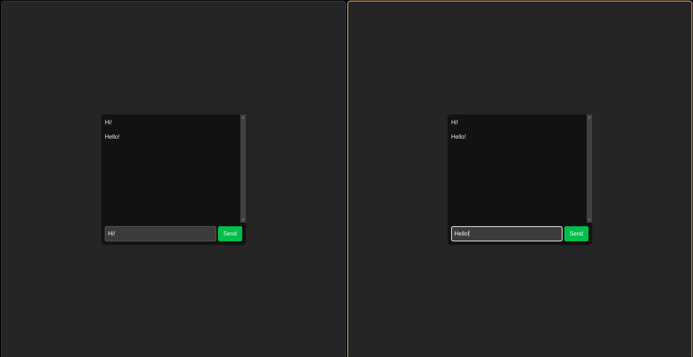

# Real-Time Chat App With Go and HTMX



Welcome to the Real-Time Chat App! This simple application allows users to communicate with each other in real time.

## Table of Contents

- [Features](#features)
- [Installation](#installation)
- [Usage](#usage)
- [License](#license)

## Features

- Real-time messaging

## Installation

1. Clone the repository:
    ```sh
    git clone https://github.com/Brian-Kariu/go-chat.git
    cd go-chat
    ```

2. Initialize the Go module:
    ```sh
    go mod tidy
    ```

## Usage

To run the application, use the following command:
```sh
go run .
```

## License

This project is licensed under the MIT License. 
